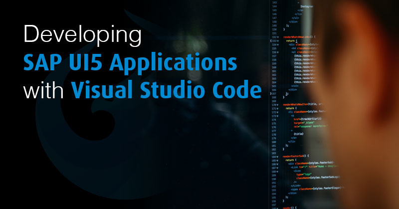
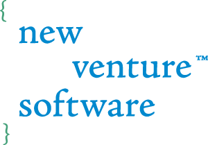

# Developing SAPUI5 Applications with Visual Studio Code
This is a companion repository to the blog post [Developing SAPUI5 Applications with Visual Studio Code](https://www.newventuresoftware.com/blog/developing-sapui5-applications-with-visual-studio-code).

## License

MIT

## Our Company

  

Do you need assistance on your project? Drop us a line at [www.newventuresoftware.com/contact](https://www.newventuresoftware.com/contact).  
New Venture Software is an expert software consulting, custom software and user experience development company. Defined by its passion for building software the right way, New Venture Software delivers amazing software experiences through technological innovation, thoughtful user experience design and flawlessly built software solutions.